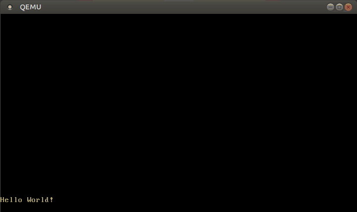

#  PH osX

[](https://docs.microsoft.com/en-us/windows/wsl/tutorials/gui-apps)
[](https://svgshare.com/i/ZhY.svg)
[](https://github.com/ThomasByr/ph_osx/blob/master/LICENSE)
[](https://GitHub.com/ThomasByr/ph_osx/commit/)
[](https://gitHub.com/ThomasByr/ph_osx/commit/)
[](https://GitHub.com/ThomasByr/ph_osx/graphs/commit-activity)

[](https://github.com/ThomasByr/ph_osx/actions/workflows/code.yml)
[](https://github.com/ThomasByr/ph_osx)
[](https://github.com/ThomasByr)

1. [✏️ In short](#️-in-short)
2. [🔰 Building](#-building)
3. [👩‍🏫 Running](#-running)
4. [💁 Testing](#-testing)
5. [⚖️ License](#️-license)
6. [🔄 Changelog](#-changelog)
7. [🐛 Bugs & TODO](#-bugs--todo)



## ✏️ In short

Let me tell you a story. This is the story of the [Zorglub-33](https://github.com/sandhose/z33-emulator) micro-controller. Well, this is no great story: like all things on Earth, z33 is temporary. Few can say they ended up writting z33 assembly. In fact, at least two newer versions of the z33 came up. But when z34 was announced in a subject paper, it was all over. So let me introduce to you : PH osX! The new and improved architecture design (well, it is based on x86), kernel and (very) basic OS for academic purposes. From basic kernel implementation through vga text buffers, all the way up to paging and multitasking, PH osX has it all.

> Of course this is no ordinary code. And this is not just buggy code. You can find and learn more about building an os from scratch in the [helper](helper/) directory or you can read the [Wiki](https://github.com/ThomasByr/ph_osx/wiki).

## 🔰 Building

This project requires a nightly version of Rust because it uses some unstable features. At least nightly _2020-07-15_ is required for building. You might need to run `rustup update nightly --force` to update to the latest nightly even if some components such as `rustfmt` are missing it.

You can build the project by running:

```ps1
cargo build
```

To create a bootable disk image from the compiled kernel, you need to install the [`bootimage`] tool:

[`bootimage`]: https://github.com/rust-osdev/bootimage

```ps1
cargo install bootimage
```

After installing, you can create the bootable disk image by running:

```ps1
cargo bootimage
```

This creates a bootable disk image in the `target/x86_64-ph_osx/debug` directory.

Please file an issue if you have any problems.

## 👩‍🏫 Running

You can run the disk image in [QEMU] through:

[qemu]: https://www.qemu.org/

```ps1
cargo run
```

[QEMU] and the [`bootimage`] tool need to be installed for this.

You can also write the image to an USB stick for booting it on a real machine. On Linux, the command for this is:

```ps1
dd if=target/x86_64-ph_osx/debug/bootimage-ph_osx.bin of=/dev/sdX && sync
```

Where `sdX` is the device name of your USB stick. **Be careful** to choose the correct device name, because everything on that device is overwritten.

## 💁 Testing

To run the unit and integration tests, execute `cargo xtest`.

## ⚖️ License

This project is licensed under the GPL-3.0 new or revised license. Please read the LICENSE file.

- Redistributions of source code must retain the above copyright notice, this list of conditions and the following disclaimer.
- Redistributions in binary form must reproduce the above copyright notice, this list of conditions and the following disclaimer in the documentation and/or other materials provided with the distribution.
- Neither the name of the PH osX authors nor the names of its contributors may be used to endorse or promote products derived from this software without specific prior written permission.

THIS SOFTWARE IS PROVIDED BY THE COPYRIGHT HOLDERS AND CONTRIBUTORS "AS IS" AND ANY EXPRESS OR IMPLIED WARRANTIES, INCLUDING, BUT NOT LIMITED TO, THE IMPLIED WARRANTIES OF MERCHANTABILITY AND FITNESS FOR A PARTICULAR PURPOSE ARE DISCLAIMED. IN NO EVENT SHALL THE COPYRIGHT HOLDER OR CONTRIBUTORS BE LIABLE FOR ANY DIRECT, INDIRECT, INCIDENTAL, SPECIAL, EXEMPLARY, OR CONSEQUENTIAL DAMAGES (INCLUDING, BUT NOT LIMITED TO, PROCUREMENT OF SUBSTITUTE GOODS OR SERVICES; LOSS OF USE, DATA, OR PROFITS; OR BUSINESS INTERRUPTION) HOWEVER CAUSED AND ON ANY THEORY OF LIABILITY, WHETHER IN CONTRACT, STRICT LIABILITY, OR TORT (INCLUDING NEGLIGENCE OR OTHERWISE) ARISING IN ANY WAY OUT OF THE USE OF THIS SOFTWARE, EVEN IF ADVISED OF THE POSSIBILITY OF SUCH DAMAGE.

## 🔄 Changelog

Please refer to the [changelog.md](changelog.md) file for the full history.


<details>
    <summary>  Still in Beta but maybe this will become an OS (click here to expand) </summary>

**v0.2.0** Memory Management

- paging
- difference between physical and virtual addr
- allocating the heap
- linked list (burps)

**v0.2.1** Multitasking

- async and await features
- implementation of the Future trait

</details>

## 🐛 Bugs & TODO

- [ ] `cargo clippy --all-targets --all-features -- -D clippy::all`
- [ ] threads
